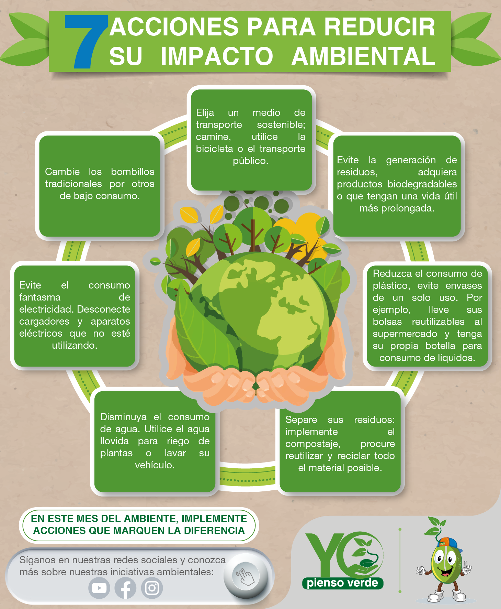

## Medidas y acciones para minimizar los impactos ambientales.

Para poder evitar tantos problemas climáticos, entre ella contaminación, residuos en el océano
y otros problemas medio ambientales, hay que tomar medidas y acciones para minimizar o reducir
al máximo esos problemas que nos perjudican a nosotros, a nuestra próxima generación y al planeta.

Estas son algunas medidas/acciones para minimizar los impactos ambientales:

* Uso de energías renovables.
* Eficiencia energética.
* Reducción, reutilización y reciclaje.
* Conservación del agua.
* Protección de la biodiversidad.
* Educación y concienciación ambiental.
* Políticas y regulaciones ambientales.
* Innovación tecnológica.

