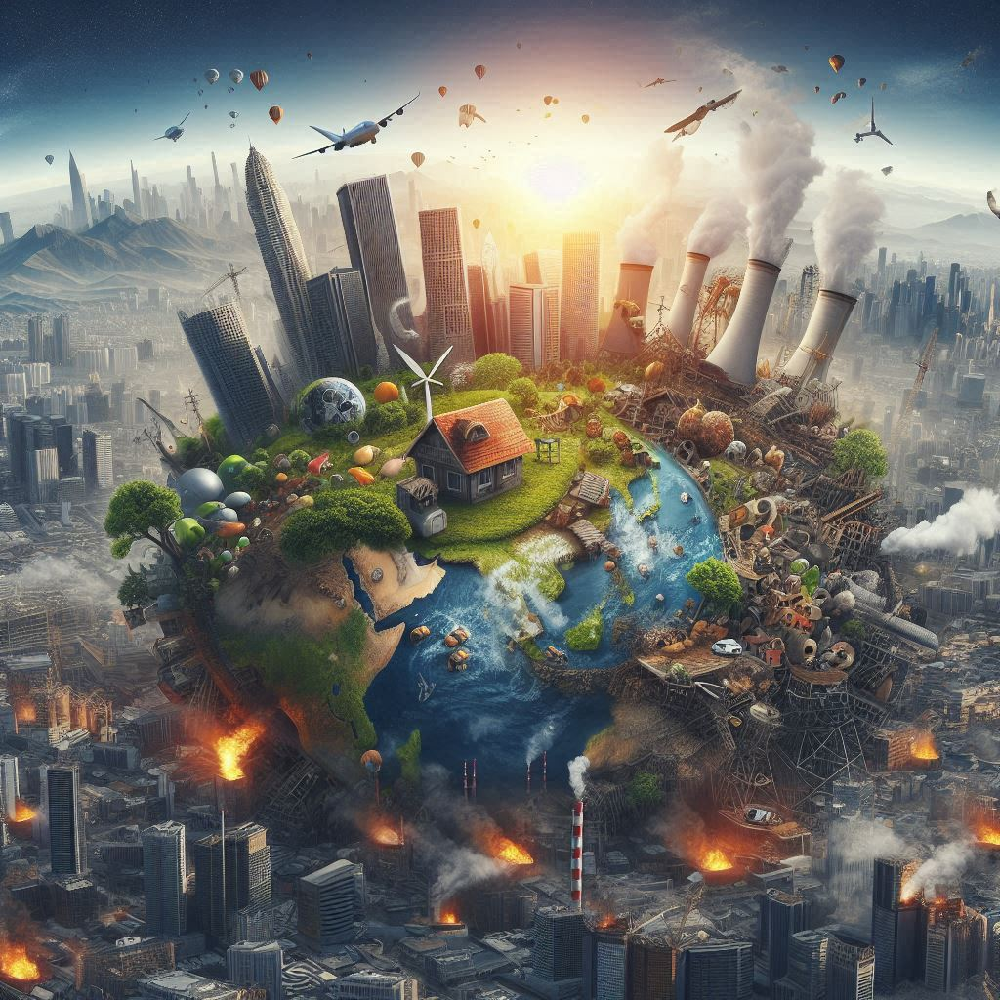
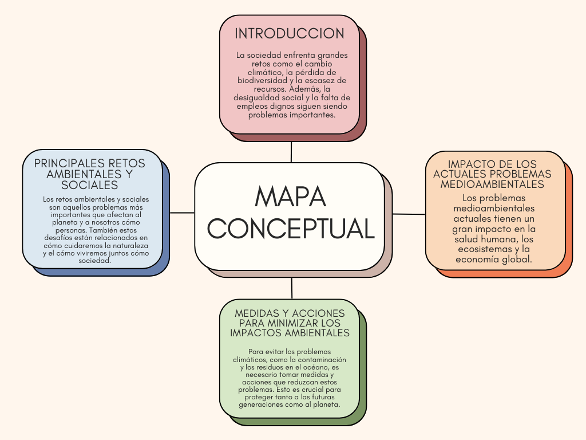

# Retos Ambientales

---
Imagen Realizada con IA
## Índice
1.1. [Introducción](introduccion.md)

1.2. [Principales retos ambientales y sociales](principalesretos.md)

1.3. [Impacto de los actuales problemas medioambientales](impacto.md)

1.4. [Medidas y acciones para minimizar los impactos ambientales](medidasyacciones.md)
 
## [Conclusiones](conclusiones.md)
## Mapa conceptual

## [Glosario (Alianza, Auditoría, Biodegradable, Efecto invernadero, Insalubre, Migración, Pandemía, Retp, Saneamiento)](https://www.canva.com/design/DAGXrMpNKFs/JnGVMU9QjNGquODAEW4UNQ/edit?utm_content=DAGXrMpNKFs&utm_campaign=designshare&utm_medium=link2&utm_source=sharebutton)
## Autores
- Iván Palma Sierra
- Iker Cupillar Aliaga
- Álvaro Moreno Dominguez
