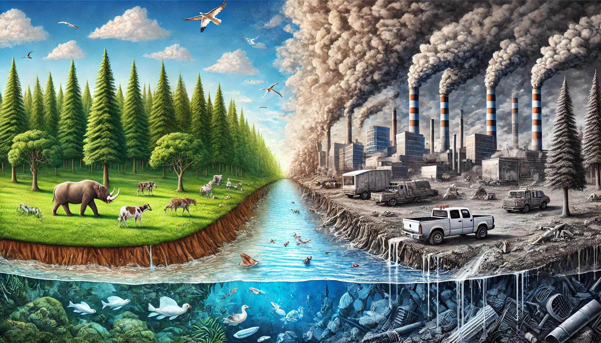

## Impacto de los actuales problemas medioambientales

Los problemas medioambientales actuales tienen un gran impacto en la salud humana, los ecosistemas y la economía global. Aquí vamos a ver algunos de los efectos más significativos;

- **Aumento de temperaturas globales**: los gases de infecto inervadero están provocando un aumneto de las temperaturas globales.

- **Fenómenos meteorológicos extremos**: el cambio climático está cada vez aumentando más la frecuencia y la intesidad de fenómenos como huracanes, sequías, olas de calor e inundaciones.

- **Desglaciación y subida del nivel del mar**: el derrimiento de los glaciares y la de los casquetes polares, junto con la expansión térmica de los oceános

- **Pérdida de la bideodiversisad**: las actividades humanas como la deforestación, la expansión agrícola, la contaminación y el cambio climático.

- **Contaminación del aire, agua y suelo**: emisiones industriales, uso excesivo de plásticos, productos, químicos agrícolas. Esto deriva en los *agentes contaminantes físicos*, que afecta a todos los seres vivos de este planeta

- **Contaminación lumínica**: esto es debido al exceso de iluminación artificial, especialmente en las areas urbanas. Tiene impactos negativos en los ecosistemas y en la salud humana.

