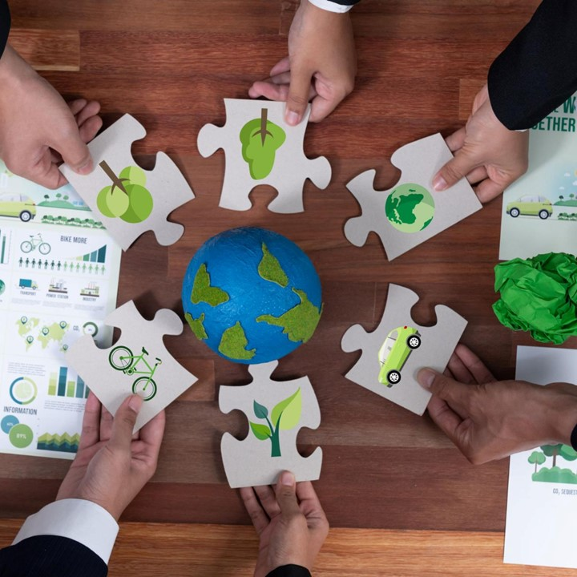

## Introduccion

La sociedad enfrenta grandes retos como el cambio climático, la pérdida de biodiversidad y la escasez de recursos. 
Además, la desigualdad social y la falta de empleos dignos siguen siendo problemas importantes. Estos desafíos están 
interconectados y exigen soluciones urgentes. Resolverlos es crucial para asegurar un futuro sostenible y justo para todos.
Y en este proyecto os explicaremos que soluciones podemos aplicar y los problemas que se pueden generar con el cambio
climático entre mucho más.

[referencia](https://www.ibm.com/mx-es/topics/environmental-issues)
