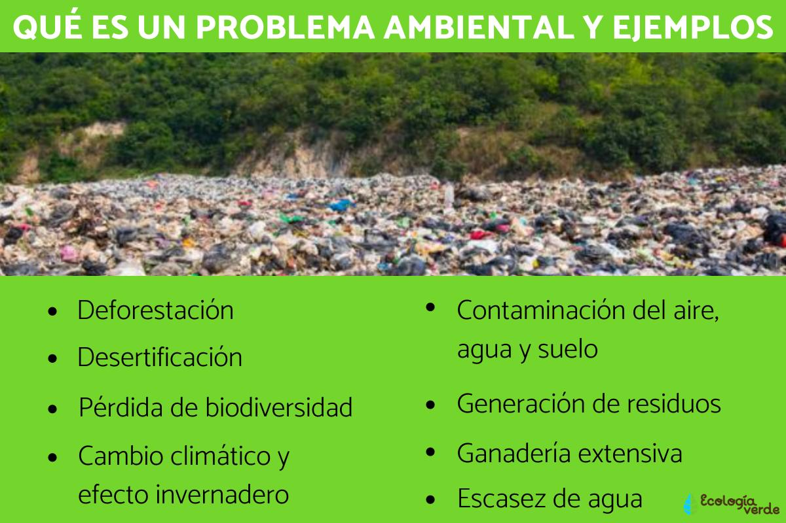

# Principales retos ambientales y sociales

Los retos ambientales y sociales son aquellos problemas más importantes que afectan
al planeta y a nosotros cómo personas. También estos desafíos están relacion-
ados en cómo cuidaremos la naturaleza y el cómo viviremos juntos cómo sociedad,
los retos ambientales son aquellos problemas que dañan al medio ambiente y ponen
en peligro la vida del planeta tierra. A continuación pondremos unos ejemplos:

* Cambio Climático: amuento de temperaturas, sequías y inundaciones.

* Contaminación: basura, plásticos y gases que dañan el aire, agua y
  tierra.

* Pérdida de hábitats: animales y plantas que desaparecen por la destrucción
  de hábitats.

* Explotación de materiales: consumimos más de lo que la naturaleza puede recrear.

También pondremos un puñado de ejemplos en el apartado de retos sociales:

* La desigualdad: muchos viven con una economía estable o buena, mientras otros
  viven en la pobreza.
  
* La pobreza: es la falta de comida, agua potable y viviendas para millones de
  personas.

* La discriminación: personas que son excluídas por su raza, género o su religión.

* La migración Forzada: las guerras y desastres que obligan a muchos a dejar su
  hogar.

  estos retos ambientales y sociales están conectados y necesitas de solución urgente.

## [Referencia](https://www.iberdrola.com/sostenibilidad/problemas-medioambientales-mas-importantes)
